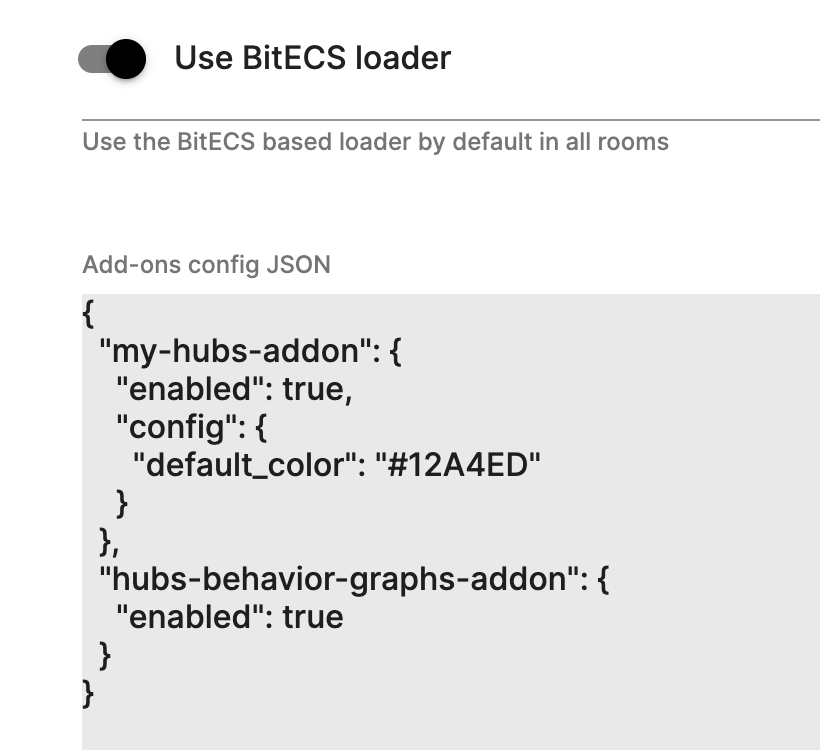
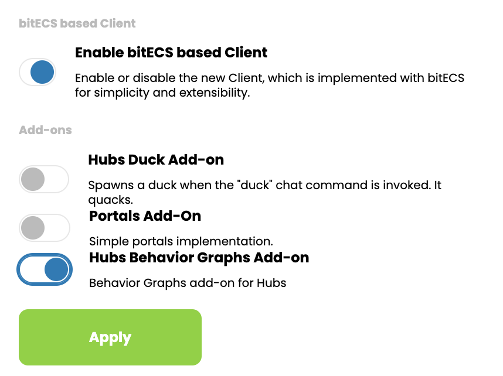

# Hubs client Add-ons

Hubs client add-ons are pluggable libraries that are installed as part of the client and loaded at runtime. Add-ons allow functionality to the Hubs core and allow easy Hubs client extensibility while maintaining the Hubs client core lean and minimal.

## Installation

Installing an addon in your Hubs client is a two step process:

1. You'll need to install the add-on package in your client. You can do that using the `npm install` as with any other npm package.
   For example if we would want to install the portals add-on we would need to do:

```
npm i https://github.com/MozillaReality/hubs-portals-addon.git
```

2. After the add-on is installed you'll need to add it to the addons array inside the `addons.json` file at the root of the Hubs client source.

```
{
  "addons": [
    ...
    "hubs-portals-addon",
    ...
  ]
}
```

Now you can build your client and run it as usual.

## Configuration

To configure your add-ons you need to update the add-on configuration JSON in the Admin console. Open your admin console and go to `App Settings -> Features`.

**Important Note**: Add-on require the bitECS based loader so you'll need to enable it for add-ons to work.

Update the add-ons JSON config with your add-ons configuration:



There are currently two properties supported in the add-ons configuration:

- **enabled**: Determines if the add-on is enabled by default in the instance rooms.
- **config**: A free form JSON containing the add-on configuration. This JSON will be passed as is to the add-on during the add-on initialization. See each add-on docs to know what JSON properties the add-on supports if any.

Once your configuration is saved, you can create or open a room in your instance and you should see add-ons running for that room.

### Room add-ons configuration

Add-ons can also be enabled/disabled per room independently from the instance configuration. To override the instance configuration you can go to your room settings and change the add-ons enabled/disabled configuration there. The room add-ons configuration will take precedence over the instance configuration if it has been changed at least once.



## Add-on development

You can develop Hubs add-ons using Javascript or Typescript.

If you are developing using Typescript you can use the add-on template as a starting point. You can get the Add-on template from [here](https://github.com/MozillaReality/hubs-template-addon).

The add-on template has the basic dependencies already configured to get started with development as fast as possible.

The easiest way of iterating over an add-on development is by linking the add-on package source from the client.

1. Create a global link for the add-on. Go to the add-ons source folder and do:

   `npm link`

   Other related commands:

   - To see all the global package links:

     `npm ls --link --global`

   - To remove a global linked package:

     `npm unlink -g`

2. Go to the Hubs client root and add a link to the add-on package:

   `npm link [package-id]`

   Other related commands:

   - You can see the currently linked packages with:

     `npm ls --link`

   - To remove a linked package:

     `npm unlink --no-save [package-id]`

Now you can build the client and the add-on should be bundled as part of the client code.

There is a typings library available for Typescript development: [Hubs Client TS Types](https://github.com/MozillaReality/hubs-ts-types)

## Currently available add-ons

- [Template add-on](https://github.com/MozillaReality/hubs-template-addon). This add-on serves as a foundation for add-on development.
- [Duck add-on](https://github.com/MozillaReality/hubs-duck-addon): Replaces the existing `/duck` chat command and refactors it into a Hubs add-on.
- [Portals add-on](https://github.com/MozillaReality/hubs-portals-addon): Simple portals implementation as an add-on that lets you spawn portals using the `/portal`. It also show how to add key bindings.
- [Behavior Graphs add-on](https://github.com/MozillaReality/hubs-behavior-graphs-addon/): Initial Behavior Graphs implementation as an add-on
